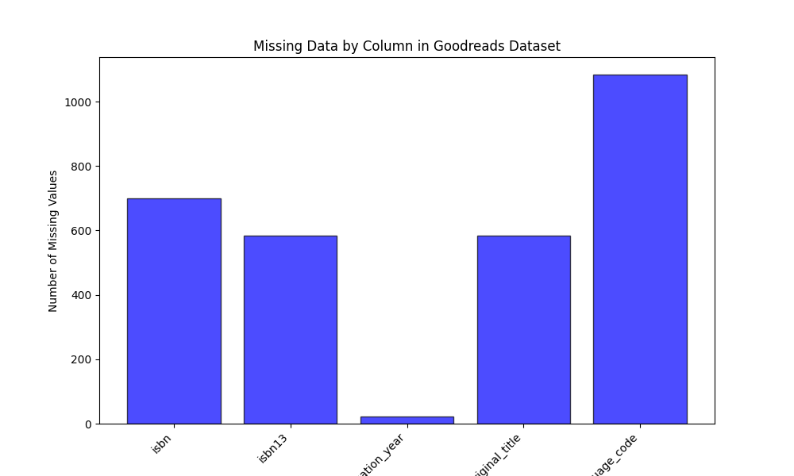
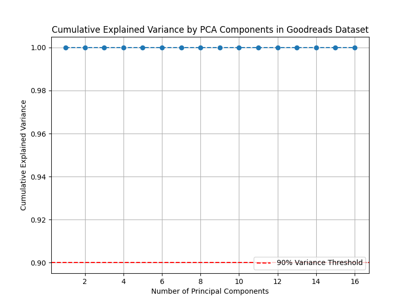
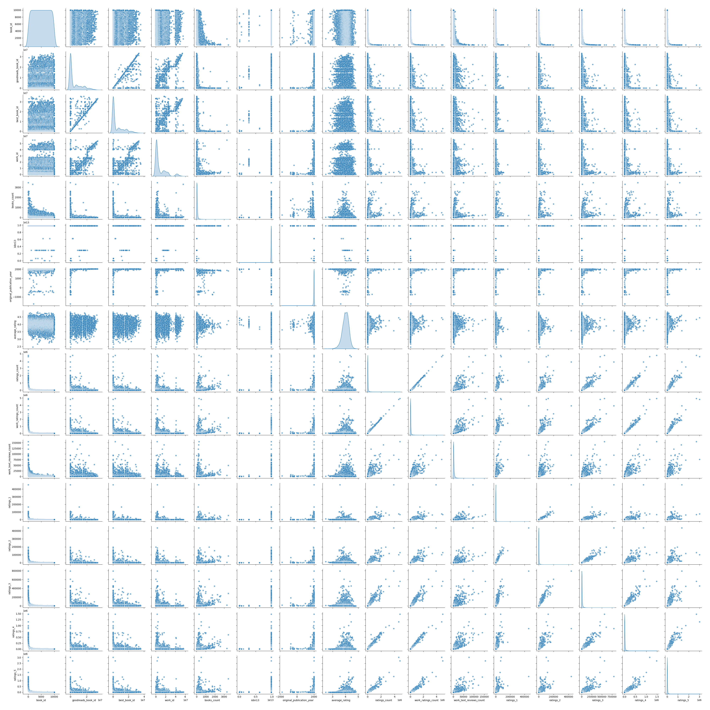
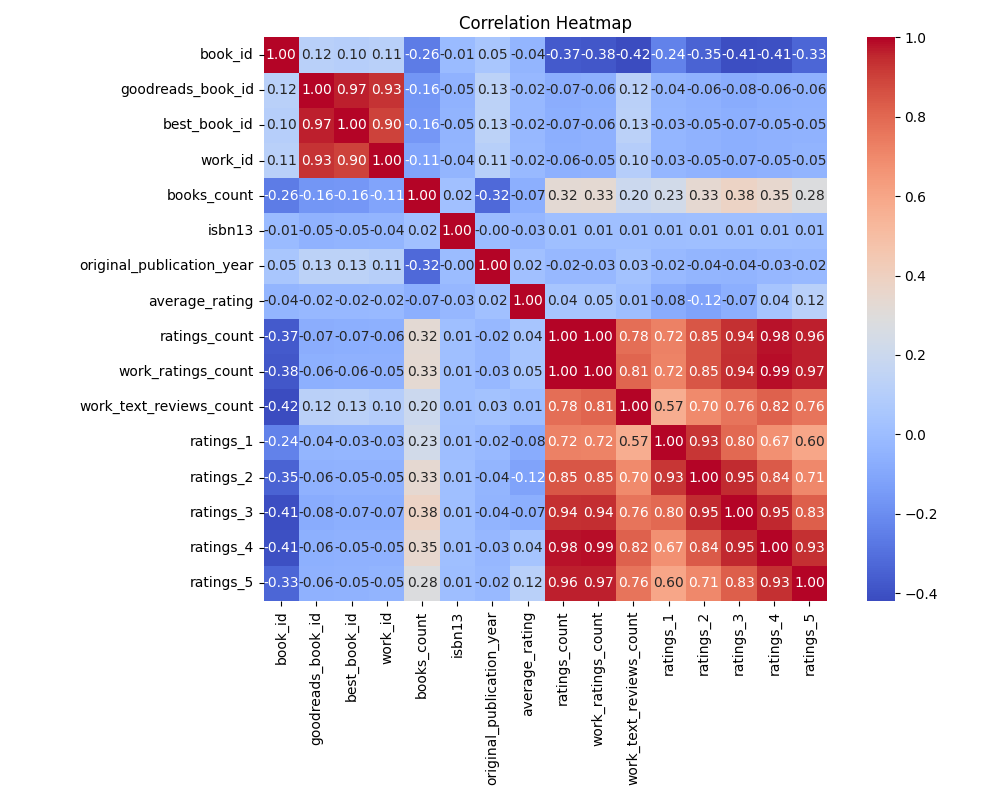

# Autolysis - Automated Dataset Analysis

## Introduction

**Autolysis** is a Python-based automation script designed to analyze CSV datasets and generate both visual and textual reports. The script leverages GPT-4o-Mini via AI Proxy to narrate insightful stories about the data, complemented by several data visualizations using Seaborn and Matplotlib.

## How it Works

1. Load the dataset using `pd.read_csv()`.
2. Perform generic data analysis including:
   - Summary statistics
   - Missing data analysis
   - Principal component analysis (PCA)
   - Correlation analysis
   - Scatter plots between numeric columns
3. Use GPT-4o-Mini via AI Proxy to generate a narrative that explains the findings.
4. Automatically create:
   - A **README.md** file containing the story of the data analysis.
   - Several **PNG charts** visualizing important aspects of the dataset.

## Installation

### Prerequisites

- Python 3.x
- Required libraries (install using `pip`):
  ```bash
  pip install pandas seaborn matplotlib scikit-learn requests python-dotenv
  ```
### Running the Script
- To run the script, use the command line and pass the CSV dataset as an argument:
  ```bash
  uv run autolysis.py dataset.csv
  ```
## Example

If you run the script with `goodreads.csv`:

```bash
uv run autolysis.py goodreads.csv
```
# It will create a directory named goodreads with the following files:

- README.md: Contains the story of the dataset analysis.
- missing_plot.png: Bar plot visualizing missing data.
- number_of_important_columns.png: Line plot of cumulative explained variance using PCA.
- scatter_plot.png: Scatter plot matrix of numeric features.
- correlation_heatmap.png: Heatmap of the correlation between numerical features.
### Analysis Summary
- For each dataset, the following analysis steps are performed:

1. Missing Data Analysis: Bar plot showing the number of missing values per column.
2. Principal Component Analysis (PCA): A plot showing the cumulative explained variance by principal components.
3. Scatter Plot: Visualizing the relationships between numeric columns.
4. Correlation Heatmap: A heatmap showing the correlation between numeric features.
### Results
- Once the analysis is complete, a report is automatically generated as a README.md file along with corresponding charts.

- Here are the generated visualizations:

- Missing Data Plot


- Cumulative Explained Variance (PCA)


- Scatter Plot

- Correlation Heatmap


### Conclusion
- The autolysis.py script simplifies the process of understanding and analyzing datasets by automating data exploration and visualization tasks. This tool can be useful for quick exploratory analysis, especially when combined with machine learning models like GPT-4o-Mini for generating narrative reports.

### License
- This project is available under the MIT License.
```bash
You can copy and paste this into your `README.md` file.
```
